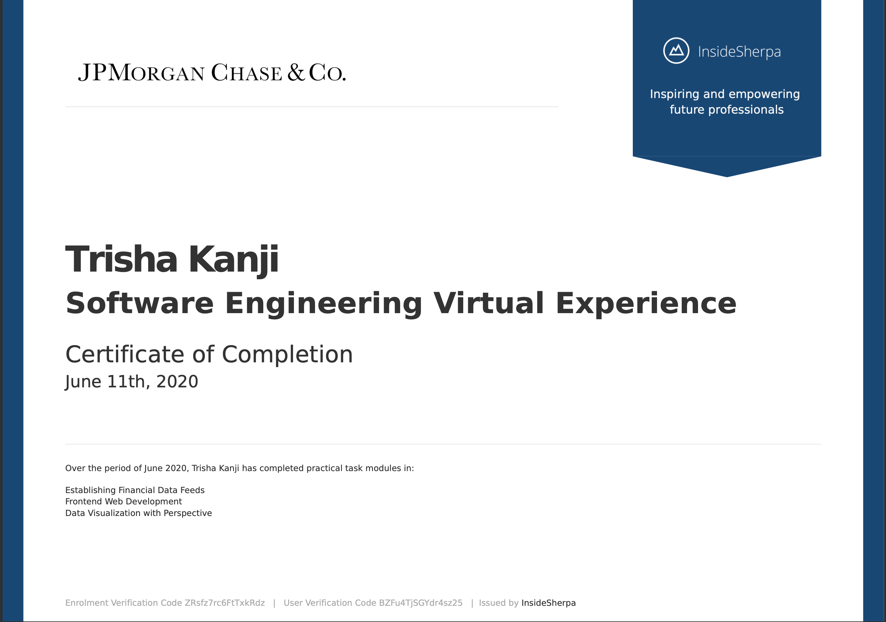

# JPMorgan Chase Software Engineering Virtual Experience 

### Task 1:
    - Interface with a stock price data feed
    (Interface with a stock price data feed and set up your system for analysis of the data)
### Task 2:
    - Implement the Perspective open source code in preparation for data visualization
### Task 3:

    - Display data visually for traders
      (Use Perspective to create the chart for the trader’s dashboard)
      
## Certificate of Completion

